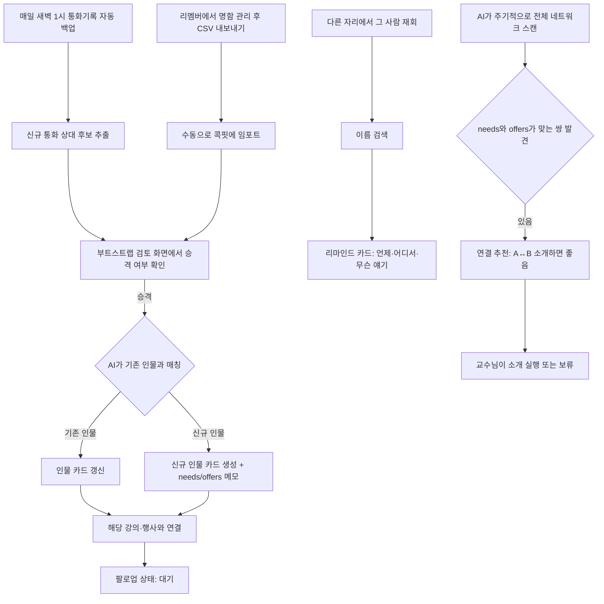

# Mega PRD v0.5 — AI Native Company 통합 업무 시스템

| 항목 | 내용 |
| --- | --- |
| 문서 버전 | v1.2 |
| 작성일 | 2026-07-25 |
| 제품 책임자 | 장동인 교수 (AIBB LAB 대표, KAIST 김재철AI대학원 책임교수) |
| 목적 | 장동인 교수의 전체 업무를 AI Native 방식으로 통합 운영하는 시스템의 최상위 설계 문서 |
| 상태 | 12개 프로세스 통합 대시보드 설계 완료. 인맥 탭은 통화기록·리멤버 명함을 AI 판단 없이 전량 업로드하고, 정리는 전적으로 교수님이 직접 수행하는 방식으로 확정 |
| 전신 문서 | docs/prd/mega-prd-v0.1.md ~ v1.1.md |

## 0. 개정 이력

| 버전 | 날짜 | 핵심 변경 |
| --- | --- | --- |
| v0.1 | 2026-07-23 | 최초 설계 — 비전, 10개 프로세스, 3층 아키텍처, 로드맵 확정 |
| v0.5 | 2026-07-25 | 개인 네트워크 CRM을 이 문서의 10장으로 통합, 핵심 목표를 "비대칭 기억 문제 해결 + 관계 연결 추천"으로 재정의 |
| v1.0 | 2026-07-25 | 11장 신설 — 12개 탭 통합 대시보드 재설계, 부트스트랩 검토(S-006)·운동 탭 화면정의 신설 |
| v1.1 | 2026-07-25 | 인맥 탭의 명함 업로드 화면(S-003)·별도 미팅 화면(S-004) 제거, 직접 입력 최소화 원칙(11.8), AI 뉴스 개인 생각 기록 예외 |
| v1.2 | 2026-07-25 | **S-006을 "AI가 걸러주는 검토 화면"에서 "전량 업로드 후 본인이 직접 정리하는 화면"으로 수정** — 통화기록·명함 데이터에 대해 AI가 필터링·판단을 하지 않는다는 원칙을 CRM-10 Phase 0·CRM-11 KPI에도 반영 |

## 1. 비전

사람은 결정하고, AI는 실행한다. 강의·집필·콘텐츠·과정 운영·정산·인맥에 이르는 전체 업무를
하나의 콕핏에서 보고, Claude 엔진이 데이터 수집·상태 판단·실행을 담당하는
**개인 단위 AI Native Company**를 구축한다.

## 2. 범위 — 11개 프로세스

| # | 프로세스 | 설명 | 데이터 원천 |
| --- | --- | --- | --- |
| 1 | ai4ceo | AI4CEO Portal 제품 개발 (하위 PRD 별도) | github.com/donchang07/ai4ceo-portal |
| 2 | 스케줄 관리 | 일정·강의 일정 통합 | Google Calendar |
| 3 | AI 뉴스·공부·정리·SNS 포스팅 | 수집→정리→초안→발행 파이프라인 | 뉴스 소스, LinkedIn 등 |
| 4 | 책쓰기 | 원고 집필·버전 관리·책→강의 변환 | Google Drive |
| 5 | 강의 준비 | 문의→확정→자료 준비 | Calendar, Gmail, Supabase(lectures) |
| 6 | 강의 후 팔로업 | 만난 사람 관리, 48시간 내 첫 메일 | Gmail, Supabase → 11번 CRM으로 흡수 예정 |
| 7 | 강사료 정산 서류 전달 | 서류 발송 추적 | Gmail, Supabase(lectures) |
| 8 | 강사료 입금 확인 | 입금 대기·지연 알림 (발송 후 14일 규칙) | Gmail, Supabase(lectures) |
| 9 | CAIO-LMS | 기수 운영 (수강생·과제·출석) | 방식 확정 필요 |
| 10 | CAIO-Alumni | 졸업생 네트워크·뉴스레터·재강의 유입 | Supabase(alumni_groups) |
| 11 | 개인 네트워크 CRM | 명함 교환·강의 청강자·CAIO 졸업생과의 관계·미팅·연결 추천 | 본인 입력 + Drive/SMS 자동 백업(통화기록·문자) + 리멤버 명함 CSV 일괄 임포트(예정), 상세 설계는 10장 |
| 12 (신규) | 운동·건강 | 매일 운동 데이터를 수집해 콕핏에 반영 — 강의(업무)와 함께 삶의 두 축 | Strava (연결됨, 실데이터 반영은 다음 단계) |

## 3. 아키텍처 — 3층 구조

1. **데이터층 (진실의 원천)** — Supabase Postgres(`ai-native-cockpit` 프로젝트) + GitHub(mega-prd 문서) + Google Calendar/Gmail/Drive
2. **엔진층 (Claude + 예약 작업)** — 매일 아침 소스 스캔 → 상태 판단 → DB 갱신, 실행은 사용자 지시 후 수행
3. **뷰층** — Supabase DB를 실시간 조회하는 웹앱. 11번 CRM 화면은 개인정보를 다루므로 **비공개 인증 화면으로 별도 분리** 예정.

## 4. 데이터 설계 원칙

- 상태 데이터는 Supabase Postgres를 단일 원천으로 한다.
- 원본 문서(책 원고, PRD)는 원래 위치(Drive, GitHub)에 두고 참조만 한다.
- 개인정보(연락처·명함·needs/offers 등)는 **비공개 테이블 + RLS**로 분리한다. 10장 CRM 전체에 적용.

## 5. 현재 상태 (2026-07-25 기준)

- **Supabase**: `ai-native-cockpit` 프로젝트 신설, 10개 테이블 생성·시딩 완료.
- **배포**: 콕핏 앱을 Vercel에 배포. 같은 프로젝트 재배포는 403 — 최초 배포만 성공하는 패턴, 원인 미확정.
- **GitHub**: mega-prd 레포 public. 콕핏의 실시간 GitHub 연결은 미구현.
- **통화기록·문자 백업**: SMS Backup & Restore 앱으로 매일 새벽 1시 Google Drive(SMS 폴더)에 자동 백업 확인. calls-*.xml(통화기록 2,000건, 연락처 이름 포함), sms-*.xml(문자 전체, 첨부 포함이라 용량 큼) 실제 확보됨. **아직 파싱·DB 반영은 하지 않음**.
- **리멤버 명함**: `개인명함첩_260725033017.xlsx` Google Drive 루트에 확보됨(약 1MB). **아직 파싱·DB 반영은 하지 않음**.
- **운동·건강(신규 12번 프로세스)**: Strava 연결 확인됨. **실제 운동 데이터 조회는 이번 세션에서 도구 연결 문제로 아직 못했음** — 다음 시도에서 확인 후 Supabase `workouts` 테이블 생성 및 콕핏 탭 반영 예정.
- **개인 네트워크 CRM**: 10장으로 설계 완료. **구현은 시작하지 않음** — 추후 bkit 파이프라인으로 일괄 생성 예정.

## 6. 로드맵

| Phase | 내용 | 상태 |
| --- | --- | --- |
| 1 | 통합 콕핏 골격 | 완료 |
| 2 | Calendar·Gmail·Drive 실데이터 연결 | 완료 |
| 3 | 강의·CAIO 데이터 스키마 확정, Supabase DB 운영 개시 | 완료 |
| 4 | ai4ceo-portal 제품화 | 대기 |
| 5 | 개인 커뮤니케이션 데이터(통화·문자·카카오톡) | 통화·문자 자동 백업 확보(Drive/SMS, 매일 새벽1시) — 파싱·활용은 10장 CRM-10 Phase 0으로 흡수. 카카오톡은 여전히 미착수 |
| 6 | 개인 네트워크 CRM(10장) — bkit으로 일괄 구현 | 설계 완료, 구현 대기 (데이터 소스는 확보됨) |
| 7 (신규) | 운동·건강(12번 프로세스) — Strava 데이터를 매일 콕핏에 반영 | 연결 확인, 실데이터 조회·`workouts` 테이블 생성 대기 |

## 7. 성공 지표

- 팔로업 착수: 강의 후 48시간 이내 100%
- 정산 누락: 0건
- 주간 SNS 발행: 2건 이상
- 콕핏 갱신: 매일 아침 자동
- 책·강의 변환: 챕터 → PPT 변환 1일 이내
- CRM 핵심 지표는 10-11장 참고

## 8. 하위 PRD

- AI4CEO Portal PRD v3.2: `ai4ceo-portal/docs/prd/prd-v3.2.md`
- AI4CEO Portal PRD v3.0: `ai4ceo-portal/docs/prd/prd-v3.0.md`
- 개인 네트워크 CRM은 별도 파일로 두지 않고 **이 문서의 10장에 통합**했다 (v0.4에서 있었던 personal-crm-prd.md는 폐기, 10장으로 대체).

## 9. 미결 사항

- [x] 레포 공개 여부 — public 확인됨
- [ ] Vercel 재배포 권한 문제 — 최초 배포만 성공, 원인 미확정
- [ ] 콕핏의 GitHub 실시간 연결 방식
- [ ] CAIO-LMS 데이터 접근 방식
- [ ] 강사료 데이터의 민감도 처리
- [ ] 책 v14 이후 퇴고 재개 일정
- [ ] Phase 5(통화·문자·카카오톡) 착수 여부
- [ ] 10장 CRM — bkit 실행 시점 (교수님 결정 대기)
- [ ] 기존 `followups` 테이블과 CRM의 `FollowUpStatus`를 통합할지, 구현 시점에 결정
- [ ] CRM-07 S-005 연결 추천의 실행 방식 — 교수님이 수동으로 [소개했음]을 누르는 방식 vs 앱이 양쪽에 직접 메시지를 보내는 방식, 결정 대기

---

# 10. 개인 네트워크 CRM — 통합 설계 (12개 항목 표준)

이 장은 별도 파일(personal-crm-prd.md)로 존재하던 하위 PRD를 이 문서로 완전히 병합한 것이다. bkit 파이프라인은 이 장의 CRM-01~CRM-12를 그대로 12개 항목 PRD로 읽어 구현에 사용한다. **이 장은 설계 문서이며, 구현은 아직 시작하지 않았다.**

제품명: 장동인교수 개인 인맥·관계 관리 시스템 (AI Native Cockpit CRM 모듈)

목적: 강의·CAIO/AI4CEO 과정·행사에서 만나는 사람들과의 관계를 기록해, "상대는 나를 기억하는데 나는 기억하지 못하는" 비대칭을 없앤다. 더 나아가 사람들 사이의 필요와 자원을 파악해, 누구를 누구에게 연결해주면 좋을지 스스로 알 수 있게 한다.

## CRM-01. 조원 및 회사 소개

| 이름 | 소속 | 역할 |
| --- | --- | --- |
| 장동인 | KAIST 김재철AI대학원 / AIBB LAB | 기획·요구사항 정의·명함 데이터 제공·최종 검수 |
| Claude Code (bkit 파이프라인) | Anthropic | 설계 문서 기반 구현·테스트 (추후 실행) |

## CRM-02. 어떤 분야에 AI를 도입하려고 하는가

개인 네트워크(인맥) 관리 분야. 목표는 "기록 보관"이 아니라 "관계 지능(relationship intelligence)"이다 — 누가 누구인지 빠르게 상기시키고, 누구와 누구를 연결해주면 좋을지 AI가 대신 파악하게 한다.

## CRM-03. 현재의 문제 ★

**고통**: 강의·행사에서 워낙 많은 사람을 만나다 보니, 상대방은 저를 기억하지만 저는 상대방을 기억하지 못하는 비대칭이 반복된다. 재회했을 때 누구인지, 무슨 얘기를 나눴는지, 어느 자리에서 만났는지 즉시 떠오르지 않아 관계가 이어지지 못한다.

**더 근본적인 문제**: 설령 기억한다 해도, 네트워크 안에서 누가 무엇을 필요로 하고 누가 무엇을 줄 수 있는지에 대한 전체 그림이 없다. A가 찾는 것을 B가 갖고 있어도, 그 접점을 스스로 떠올리지 못하면 연결은 일어나지 않는다. 지금은 이 판단을 순전히 기억력에 의존하고 있다.

**기존 대안의 한계**: 명함을 사진으로만 찍어두거나 엑셀로 수기 관리를 시도했지만 지속되지 않았고, "이 사람과 저 사람을 연결하면 좋겠다"는 판단을 도와주는 도구는 전혀 없었다. CAIO-Alumni 탭(2장 참고)도 기수 단위 집계일 뿐, 개인 간 연결 가능성은 보여주지 않는다.

**문제의 규모**: 연간 강의·행사 20회 이상, CAIO·AI4CEO 매 기수 약 30명, 누적 졸업생 121명. 네트워크 규모가 커질수록 사람 기억과 연결 판단은 더 불가능해진다.

## CRM-04. 사용자 정의 (페르소나)

1차 사용자: 장동인교수 본인(유일한 사용자).

페르소나: 폭넓은 사람을 만나는 강연자 겸 교육자. 상대는 나를 알아보는데 나는 상대를 즉시 기억해내지 못해 어색한 순간이 반복됨. "이 사람 소개해주면 좋겠다"는 생각이 스쳐도 금방 잊어버리고, 네트워크 전체를 놓고 누구와 누구를 이어줄지 체계적으로 떠올릴 방법이 없음.

## CRM-05. AI 기능

- 인물 카드에 "필요로 하는 것(needs)"과 "제공할 수 있는 것(offers/전문분야)"을 함께 기록한다
- 재회 시 이름 한두 글자만 검색해도 "누구인지, 언제·어디서 만났는지, 무슨 얘기를 나눴는지"를 즉시 보여주는 빠른 리마인드 카드를 제공한다
- 인물을 만난 강의·행사와 자동으로 연결한다(2장 lectures와 연계)
- 인물이 CAIO/AI4CEO 졸업생인지 자동으로 매칭한다(2장 cohorts·alumni_groups와 연계)
- **네트워크 전체를 살펴 "A가 필요로 하는 것을 B가 제공할 수 있는" 조합을 찾아 연결(소개) 후보를 추천한다** — 이 모듈의 핵심 기능
- 미팅을 간단히 기록한다(날짜, 장소, 한 줄 메모) — 인물 상세 화면에서 바로 입력, 별도 화면 없음
- 팔로업 상태를 추적하고, 접촉 후 48시간이 지나면 알려준다
- 인물별로 만남 이력을 시간순으로 모아 보여준다(타임라인)
- 회사·기수·마지막 접촉일·needs/offers 키워드로 검색·필터링한다
- **(신규) 매일 새벽 1시 Drive에 자동 백업되는 통화기록·문자에서 새로운 통화 상대를 자동으로 인물 후보로 추출한다** — 전화번호와 폰에 저장된 연락처 이름을 매칭해 인물 카드 기초값을 채운다
- **(신규) 통화 빈도와 마지막 통화일을 근거로 "오래 연락하지 않은 사람"을 자동으로 재접촉 후보에 올린다** — 지금까지는 본인이 기억해서 수동으로 표시해야 했지만, 실제 통화 이력으로 자동 판단한다
- **(신규) 문자 중 수강신청·입금 알림 문자를 자동 인식해 5·8번 프로세스(강의 정산)와 연결한다**
- **리멤버(Remember) 앱에서 내보낸 명함 CSV를 주기적으로(수동) 임포트해, 이미 등록해 둔 명함 전체를 인물 후보로 일괄 생성한다** — 명함은 리멤버에서만 관리하고, 콕핏 내 사진 업로드 기능은 두지 않는다

인물 데이터의 원천은 **통화기록 자동 백업 + 리멤버 CSV 수동 임포트** 두 가지뿐이다. 콕핏 안에서 직접 입력하는 항목은 needs/offers, 간단 미팅 메모 등 최소한으로 제한한다.

## CRM-06. 사용자 시나리오



## CRM-07. 화면 정의 ⭐

### 화면 S-001: 인물 목록

```
+------------------------------------+
│ 인맥                                │
+------------------------------------+
│ 검색: [_______________]  필터: [▾] │
+------------------------------------+
│ 김OO · A사 · CAIO 11기 · 7/28 접촉 │
│ 이OO · B사 · 청강자 · 6/17 접촉    │
│ 박OO · C사 · CAIO 3기 · 재접촉필요 │
+------------------------------------+
```
- **목적**: 전체 인물을 한눈에 보고 재접촉이 필요한 사람을 찾는다
- **동작**: 카드 클릭 시 S-002로 이동. 새 인물은 통화기록·리멤버 CSV가 S-006에서 전량 업로드되며 자동으로 채워진다(필터 없음)
- **빈 상태**: "아직 등록된 인물이 없습니다 — 부트스트랩 검토에서 후보를 승격해 보세요"
- **에러 상태**: 상단 빨간 배너로 불러오기 실패 메시지

### 화면 S-002: 인물 상세 · 리마인드 카드

```
+------------------------------------+
│ 김OO  ·  A사 팀장                  │
│ CAIO 11기  ·  연락처: ***-****     │
+------------------------------------+
│ 리마인드                            │
│  마지막 만남: 7/28 에스넷 강의      │
│  나눈 얘기: 신사업 관련 AX 고민     │
│  Needs: 바이브코딩 내부 강의 소개   │
│  Offers: 제조업 AX 실행 경험        │
+------------------------------------+
│ 타임라인                            │
│  7/28  에스넷 강의에서 명함 교환    │
│  8/21  CAIO 11기 인트로 참석        │
│  [+ 한 줄 메모 추가]                │
+------------------------------------+
│ 팔로업 상태: [대기 ▾]  [완료 처리]  │
+------------------------------------+
```
- **목적**: 이 사람을 다시 만났을 때 "누구인지"를 3초 안에 파악한다 — 이 제품의 핵심 화면
- **동작**: [완료 처리] 클릭 시 팔로업 상태 변경. Needs/Offers는 이 화면에서 바로 수정. [+ 한 줄 메모 추가]는 별도 화면 없이 그 자리에서 날짜·장소·한 줄 메모만 입력하는 인라인 입력(원래 별도 화면이었던 미팅 기록 추가를 통합)
- **빈 상태**: "아직 기록된 미팅이 없습니다"
- **에러 상태**: 저장 실패 시 상단 배너, 입력값 유지

### 화면 S-005: 연결 추천 ⭐

```
+------------------------------------+
│ 연결 추천                           │
+------------------------------------+
│ 김OO(A사) ↔ 박OO(CAIO 3기)         │
│  김OO: 바이브코딩 내부 강의 필요    │
│  박OO: 제조업 AX 실행 경험 보유     │
│  [소개했음]  [보류]  [관심없음]     │
+------------------------------------+
```
- **목적**: 이 제품이 존재하는 이유 — 사람 기억이 아니라 AI가 네트워크 전체를 보고 연결 지점을 찾아준다
- **동작**: [소개했음] 클릭 시 두 사람의 타임라인에 "소개됨" 기록이 남고 목록에서 제외. [관심없음]은 같은 쌍을 다시 추천하지 않음
- **빈 상태**: "현재 추천할 연결이 없습니다 — needs/offers를 더 채우면 추천이 늘어납니다"
- **에러 상태**: 추천 계산 실패 시 "잠시 후 다시 시도해 주세요"

## CRM-08. 기술 요구사항 ⭐

### 기술 스택
- **프론트**: AI Native Cockpit과 동일한 스택 재사용 — 기존 콕핏에 탭으로 통합
- **DB**: Supabase Postgres — 기존 ai-native-cockpit 프로젝트에 신규 테이블 추가
- **AI 매칭**: Claude API — needs/offers 텍스트 기반 연결 후보 매칭 (명함 OCR은 리멤버가 대신하므로 불필요)
- **배포**: Vercel(기존 콕핏과 동일 프로젝트 또는 신규 프로젝트, 배포 시점에 결정)

### 데이터 모델
```
People (인물)
 +- id: UUID (PK)
 +- name: string
 +- company: string (null 가능)
 +- title: string (null 가능)
 +- contact: string (null 가능, 개인정보 — 비공개 테이블)
 +- needs: text (null 가능)
 +- offers: text (null 가능)
 +- source: string (call_log/remember_csv/manual, 신규 — 최초 등록 경로)
 +- cohort_link: FK -> cohorts.id (null 가능)
 +- first_met_at: date
 +- last_contact_at: date
 +- created_at: timestamptz

Meetings (미팅 기록)
 +- id: UUID (PK)
 +- person_id: FK -> People.id
 +- lecture_id: FK -> lectures.id (null 가능)
 +- meeting_date: date
 +- location: string (null 가능)
 +- summary: text (null 가능)
 +- next_action: text (null 가능)
 +- created_at: timestamptz

FollowUpStatus (팔로업 상태)
 +- id: UUID (PK)
 +- person_id: FK -> People.id
 +- status: string (pending/done)
 +- detected_at: date
 +- resolved_at: date (null 가능)

Introductions (연결 추천/이력)
 +- id: UUID (PK)
 +- person_a_id: FK -> People.id
 +- person_b_id: FK -> People.id
 +- match_reason: text
 +- status: string (suggested/done/dismissed)
 +- suggested_at: date
 +- resolved_at: date (null 가능)

CallLogImports (통화기록 원본 임포트, 신규)
 +- id: UUID (PK)
 +- phone_number: string
 +- contact_name_raw: string (null 가능, 폰에 저장된 이름 그대로)
 +- call_type: string (incoming/outgoing/missed)
 +- duration_sec: integer
 +- called_at: timestamptz
 +- matched_person_id: FK -> People.id (null 가능, 매칭 전에는 비어 있음)
 +- source_file: string (예: calls-20260725025952.xml)
 +- imported_at: timestamptz

RememberCardImports (리멤버 명함 CSV 원본 임포트, 신규)
 +- id: UUID (PK)
 +- name: string
 +- company: string (null 가능)
 +- title: string (null 가능)
 +- phone: string (null 가능)
 +- email: string (null 가능)
 +- memo: string (null 가능, 리멤버에 남겨둔 메모)
 +- registered_at: date (null 가능, 리멤버 등록일)
 +- matched_person_id: FK -> People.id (null 가능, 매칭 전에는 비어 있음)
 +- source_file: string (내보낸 CSV 파일명)
 +- imported_at: timestamptz
```
People 테이블에는 `source` 필드(예: business_card/call_log/manual)를 추가해 이 인물이 어떤 경로로 처음 등록됐는지 구분한다.

기존 `followups` 테이블(현재 빈 테이블)은 FollowUpStatus로 대체하거나 통합 검토가 필요하다 — 구현 시점에 결정.

### 비기능 요구사항
- 연락처·명함·needs/offers 등 타인의 개인정보는 **비공개 테이블**로 두고 공개 콕핏 화면과 분리한다 (4장 원칙)
- RLS: 본인만 읽기·쓰기 가능, anon 공개 읽기 정책을 적용하지 않는다
- Introductions 추천은 두 사람 모두의 동의 없이 자동 발송되지 않는다 — 항상 교수님의 [소개했음] 실행을 거친다

## CRM-09. 데이터 확보 방안

- **필요한 데이터**: 미팅 한 줄 메모, needs/offers 메모(본인 입력, 최소화) + **통화기록·문자(자동 확보)** + **리멤버 명함 CSV(수동 임포트, 확보됨)** + CAIO/AI4CEO 기수 정보(2장 기존 테이블 재사용)
- **출처**:
  - 명함·미팅·needs/offers: 본인이 직접 촬영·입력
  - **통화기록·문자: SMS Backup & Restore 앱이 매일 새벽 1시 Google Drive의 `SMS` 폴더에 자동 백업(2026-07-25부터 가동 확인). 통화기록은 `calls-*.xml`(전화번호·통화시간·날짜·저장된 연락처 이름 포함), 문자는 `sms-*.xml`로 쌓인다. 실제로 통화기록 2,000건이 이미 확보된 상태다.**
  - **리멤버(Remember) 명함: 실제로 내보내기 완료. `개인명함첩_260725033017.xlsx` 파일이 Google Drive에 확보됨(약 1MB, 2026-07-24). 이름·회사·직함·연락처·메모·등록일이 텍스트로 포함되며, 명함 이미지는 포함되지 않는다.**
  - 외부 크롤링이나 합성 데이터는 없음
- **난이도**: 하 — 이미 자동화된 파이프라인이 가동 중이므로 남은 작업은 파싱·매칭 로직뿐(구현 시점)
- **저작권·개인정보**: CRM-08 비기능 요구사항의 비공개 원칙을 반드시 지킨다. 통화기록·문자에는 타인의 실명·직함·번호가 그대로 담기므로 특히 엄격히 비공개로 다룬다
- **용량 참고**: 문자 백업(`sms-*.xml`)은 MMS 첨부가 포함돼 700MB를 넘을 수 있다. 이미지 백업을 끄면 가벼워지지만, 지금은 그대로 둔 상태다

## CRM-10. 구현 방안 및 일정

이 표는 **추후 bkit 파이프라인 실행 시점**의 계획이며, 지금은 실행하지 않는다.

| Phase | 목표 | 완료 조건 |
| --- | --- | --- |
| **Phase 0 (신규)** | **인물 일괄 업로드** — Drive/SMS의 calls-*.xml + 리멤버 명함 CSV를 예외 없이 전량 People로 업로드한다. AI는 필터링·판단을 하지 않는다 | 통화기록 2,000건 + 리멤버 명함 전체가 People로 업로드됨(11.4 참고). 정리는 교수님이 직접 |
| Phase 1 | 인물·미팅 데이터 모델 구축 | People/Meetings/FollowUpStatus/Introductions/CallLogImports/RememberCardImports 테이블 생성 |
| Phase 2 | 인물 목록·리마인드 카드 (S-001, S-002) | 재회 시 3초 안에 이력 확인 가능 |
| Phase 3 | 강의·CAIO 기수 자동 연결 + 팔로업 알림 | lectures·cohorts 매칭, 48시간 알림, 통화 빈도 기반 재접촉 알림 |
| Phase 4 | 연결 추천 엔진 (S-005) | needs/offers 매칭 로직 동작, 추천 정확도 검증 |
| Phase 5 | 문자 기반 정산 자동 매칭 | sms-*.xml에서 입금·수강신청 문자를 인식해 강의 정산 체크리스트(7·8번 프로세스)와 연결 |

## CRM-11. 성과 측정 방법 (KPI)

| KPI | 목표 값 |
| --- | --- |
| 재회 시 리마인드 카드로 즉시 파악 가능한 비율 | ≥ 90% |
| 강의 후 48시간 내 팔로업 착수율 | 100% |
| **실제 소개·연결로 이어진 건수** | 지속 증가 추세 — 이 모듈의 핵심 성공 지표 |
| CAIO 졸업생 재접촉·재강의 유입 건수 | 현재 4건 대비 증가 |
| 일괄 업로드된 인물 카드 수 | Phase 0 완료 시 측정(통화기록·리멤버 CSV 전량) |

## CRM-12. 팀원별 역할 분담

| 담당 | 담당 섹션 | 담당 기능 |
| --- | --- | --- |
| 장동인교수 | CRM-01, 03, 04, 11 | 기획·요구사항·명함 데이터 제공·최종 검수 |
| Claude Code (bkit) | CRM-05~10, 12 | 설계·구현·테스트 (추후 실행) |

---

# 11. 통합 대시보드 — 재설계 (v1.0)

지금까지 화면정의는 두 갈래로 흩어져 있었다. 원래 콕핏 10개 탭(실제 배포됨, Supabase 연동)과 10장의 CRM 5개 화면(설계만 됨, 별도 흐름처럼 보임)이 서로 다른 문서 스타일로 존재했다. 이제 통화기록·문자·리멤버 명함이라는 실데이터가 확보됐으므로, **하나의 내비게이션 아래 12개 탭으로 통합**하고, 실데이터를 보고 드러난 화면정의의 빈틈을 메운다.

## 11.1 화면정의 재검토 — 실데이터를 보고 새로 드러난 것

통화기록 2,000건의 실제 내용을 확인해 보니, `(Unknown)` 번호나 0초짜리 부재중 통화도 섞여 있었다. 처음에는 AI가 걸러서 보여줄지 판단하는 화면을 넣으려 했으나, **교수님이 명확히 하셨다 — 필터링·판단은 AI가 하지 않는다. 전부 그대로 업로드하고, 정리는 본인이 직접 한다.**

**결론**: CRM-10 Phase 0(부트스트랩)은 통화기록 2,000건 + 리멤버 명함 전체를 **예외 없이 전량 업로드**한다. AI는 후보를 자동으로 골라내거나 감추지 않는다. S-006은 "AI가 승인한 것만 보여주는 검토 화면"이 아니라, 전체를 다 보여주고 정리 도구(검색·필터·일괄 삭제)만 제공하는 화면으로 바꾼다.

## 11.2 통합 내비게이션 — 12개 탭

| 순서 | 탭 표시명 | 대응 프로세스 | 데이터 상태 |
| --- | --- | --- | --- |
| 1 | 홈·오늘 | 전체 프로세스 신호 종합 (11.3 참고) | 실데이터 + 대기 신호 혼합 |
| 2 | ai4ceo | 1 | 확인 중(GitHub 미연결) |
| 3 | Mega PRD | 1 | 확인 중(GitHub 미연결) |
| 4 | 스케줄 | 2 | 실데이터(Supabase) |
| 5 | AI 뉴스·SNS | 3 | 실데이터(Supabase) |
| 6 | 책쓰기 | 4 | 실데이터(Supabase) |
| 7 | 강의 파이프라인 | 5·6·7·8 | 실데이터(Supabase) |
| 8 | CAIO-LMS | 9 | 실데이터(Supabase) |
| 9 | CAIO-Alumni | 10 | 실데이터(Supabase) |
| 10 | **인맥** | 11 (CRM, 10장) | 원본 파일 확보(통화 2,000건·명함 xlsx), **DB 미반영·구현 보류(bkit)** |
| 11 | **운동** | 12 | Strava 연결됨, **데이터 미반영** |
| 12 | 시스템 | 메타 | 실데이터(Supabase) |

"인맥"은 CRM의 나머지 화면(S-001~S-006)을 하위 흐름으로 갖는 탭이고, "운동"은 아래 11.5의 새 화면을 갖는 탭이다. 두 탭 모두 지금 배포된 앱의 탭 목록에는 아직 없다 — bkit 구현(인맥) 및 Strava 데이터 반영(운동) 이후 추가된다.

## 11.3 홈·오늘 재설계 — 12개 프로세스를 가로지르는 화면

지금 홈 화면의 KPI는 강의·정산 중심 4장이었다. 이제 인맥·운동을 포함한 전체 신호를 담도록 6장으로 늘린다.

```
+--------------------------------------------------+
| 오늘 일정 | 미해결 항목 | 예정 강의·행사 | 최근 완료 |
| 재접촉 필요 인원 (인맥) | 이번 주 운동 (운동) |
+--------------------------------------------------+
```

- **재접촉 필요 인원**: CRM의 FollowUpStatus·People.last_contact_at 기준. **인맥 탭이 구현되기 전까지는 "대기 — bkit 구현 후 표시"로 비활성 카드 표시.**
- **이번 주 운동**: workouts 테이블 기준 이번 주 활동 횟수. **Strava 데이터가 아직 DB에 없으므로 마찬가지로 "대기" 카드.**

두 카드 모두 지금 당장 실제 숫자를 보여줄 수는 없다 — 원본 데이터는 있지만 DB 반영이 안 됐기 때문이다. 화면 자리와 조건은 지금 확정하고, 숫자는 데이터가 들어오는 순간부터 자동으로 채워지는 구조로 설계한다.

## 11.4 신설 화면 S-006: 인맥 일괄 업로드 결과 (인맥 탭 하위)

```
+------------------------------------+
| 일괄 업로드 결과 (2,000건 + 명함)   |
+------------------------------------+
| [x] 이환철 상무(HL만도) · 통화 3회  |
| [x] (Unknown) 010-****-2211 · 1회   |
| [x] 배달콜 추정 · 010-****-8842     |
+------------------------------------+
| 검색: [_______________]             |
|            [선택 삭제] [전체 보기]  |
+------------------------------------+
```

- **목적**: 통화기록·리멤버 CSV를 전량 업로드한 결과를 보여준다. AI가 무엇을 남길지 판단하지 않는다 — 전부 People로 들어오고, 정리는 교수님이 원하는 시점에 원하는 방식대로(검색해서 지우기, 회사별로 훑어보기 등) 직접 한다
- **동작**: 업로드 즉시 전체가 목록에 나타난다. 기본 필터 없음(전체 보기가 기본값). [선택 삭제]로 불필요한 항목을 지울 수 있지만 자동으로 숨기거나 걸러내지 않는다
- **빈 상태**: 해당 없음(업로드 직후 항상 전체가 보임)
- CRM-10 Phase 0 완료 조건: "통화기록 2,000건 + 리멤버 명함 전체가 예외 없이 People로 업로드됨. 정리·삭제는 전적으로 교수님 판단"

## 11.5 신설 화면 — 운동 탭 (S-EX-001, S-EX-002)

### S-EX-001: 운동 홈

```
+------------------------------------+
| 운동                                |
+------------------------------------+
| 이번 주 3회 | 이번 달 12회 | 연속 4일 |
+------------------------------------+
| 최근 활동                            |
|  7/24  러닝 5.2km 28분              |
|  7/22  사이클 15km 42분             |
|  7/20  러닝 4.8km 26분              |
+------------------------------------+
```

- **목적**: 강의(업무)와 대칭을 이루는 삶의 다른 축을 매일 확인한다
- **동작**: Strava에서 매일 동기화된 활동을 최신순으로 표시
- **빈 상태**: "아직 동기화된 활동이 없습니다"

### S-EX-002: 운동 전체 이력

```
+------------------------------------+
| 전체 이력                 [기간 ▾]  |
+------------------------------------+
| 날짜 | 종류 | 거리 | 시간 | 페이스   |
| ...                                  |
+------------------------------------+
```

## 11.6 데이터 모델 추가 — workouts

```
Workouts (운동 기록)
 +- id: UUID (PK)
 +- activity_date: date
 +- activity_type: string (run/ride/swim/etc)
 +- duration_sec: integer
 +- distance_km: numeric (null 가능)
 +- source: string (strava)
 +- external_id: string (Strava activity id, 중복 동기화 방지)
 +- synced_at: timestamptz
```

RLS는 기존 콕핏 10개 테이블과 동일하게 공개 읽기로 둔다(개인정보가 아니므로 CRM과 달리 비공개 처리 불필요).

## 11.7 통합 데이터 소스 상태표 (시스템 탭 반영용)

| 소스 | 담당 프로세스 | 상태 |
| --- | --- | --- |
| Google Calendar | 스케줄·강의 | 연결됨 |
| Gmail | 정산·팔로업 | 연결됨 |
| Google Drive | 책·원본 파일 저장소 | 연결됨 |
| Supabase(ai-native-cockpit) | 스케줄·뉴스·책·강의·CAIO·백로그·시스템 | 연결됨(10개 테이블) |
| GitHub | Mega PRD·ai4ceo-portal | 확인 중 |
| Vercel | 콕핏 배포 | 확인 중(재배포 권한 문제) |
| Drive/SMS 폴더 | 통화기록·문자 원본 | 확보됨, DB 미반영 |
| 리멤버 CSV | 명함 원본 | 확보됨, DB 미반영 |
| Strava | 운동 원본 | 연결됨, DB 미반영 |
| Sooji | AI 뉴스·공부 노트 | 미연결 |
| CAIO-LMS 내부 | 수강생·과제 | 방식 미정 |

## 11.8 직접 입력 최소화 원칙 — 예외: AI 뉴스 개인 생각 기록

이번 리뷰에서 정한 원칙: **콕핏 안에서 직접 타이핑하는 입력은 최소화한다.** 명함(리멤버에서 관리), 통화·문자(자동 백업), 운동(Strava 자동 동기화)은 전부 외부에서 이미 만들어진 데이터를 가져오는 방식이다. 인맥 탭의 needs/offers·미팅 한 줄 메모 정도만 예외적으로 남는 최소한의 직접 입력이다.

**단, 하나는 의도적으로 남긴다** — AI 뉴스·SNS(3번 프로세스)에서 각 뉴스 항목에 대한 **본인 생각을 기록하는 기능**이다. 이건 자동 수집으로 대체할 수 없는, 콕핏의 가치가 실제로 발생하는 지점이므로 예외로 유지한다.

- `news_items` 테이블(이미 존재, 2장)에 `my_thoughts: text (null 가능)` 필드를 추가한다
- AI 뉴스·SNS 탭의 각 뉴스 카드에 "내 생각" 한 줄 입력란을 둔다 — 여기 남긴 생각이 이후 "초안 만들어줘" 요청 시 SNS 포스팅 초안의 관점으로 그대로 반영된다
